# debian-mate-ayatana-settings

This repository contains special meta-package for Debian 12 (*bookworm*) and allows user to install fully-featured MATE desktop environment with Ayatana Indicators which are currently in wide use only in Ubuntu MATE flavour (since 20.10 aka *groovy*).

First of all I would like to thank the developers of original [`ubuntu-mate-settings` package](https://github.com/ubuntu-mate/ubuntu-mate-settings/). It makes possible to bring the same concept to the original Debian system with MATE desktop environment and Ayatana Indicators.

## How to install and use this package

This package is prepared for the Debian 12 (*bookworm*) system. The most reproducible and lightweight method of installation in terms of both network traffic and disk space would be to download network install image (for example [*debian-12.5.0-amd64-netinst.iso*](https://cdimage.debian.org/debian-cd/current/amd64/iso-cd/debian-12.5.0-amd64-netinst.iso)) and then install it with selected MATE desktop environment task as shown below:

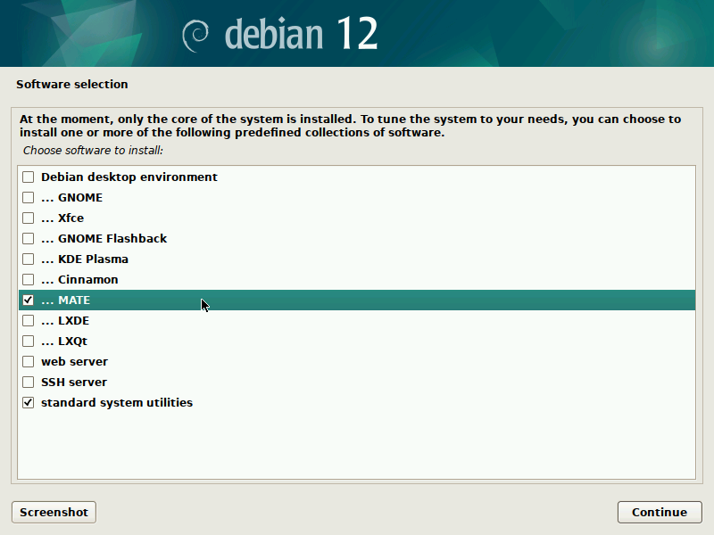

Then login to the system as normal user using LightDM to see default MATE desktop environment as it was configured by Debian community.

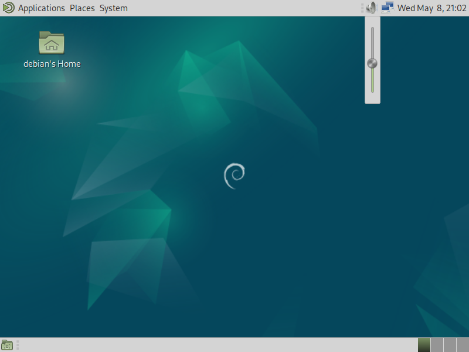

On the above image one can note the minimalism of traditional GNOME 2.32-like panel layout, such default MATE system has simple notification area without legacy AppIndicator and without modern Ayatana Indicators.

This freshly installed system should be configured - we need to enable *sudo*, update the package indexes, upgrade all packages and enable all the repositories:

```sh
$ su -l -c "usermod -a -G sudo $USER"
$ su -
# apt-get update
# apt-get dist-upgrade
# apt-get install software-properties-common python3-launchpadlib
# add-apt-repository -y main contrib non-free non-free-firmware
# reboot
```

Then we need to add [the repository](https://launchpad.net/~nrbrtx/+archive/ubuntu/dmas) with the package:

```sh
sudo add-apt-repository -y "deb http://ppa.launchpad.net/nrbrtx/dmas/ubuntu jammy main"
```

This `debian-mate-ayatana-settings` meta-package may be installed in one of the following two ways:

* to get the minimal set of packages including MATE Tweak and MATE Panel layouts (Contemporary, Cupertino, Familiar, Fedora, Mutiny, Pantheon, Redmond, Tradional), Plank, Tilda, MATE HUD, Brisk Menu, Ayatana Indicators inside MATE Indicator Applet Complete (Application, Datetime, Messages, Notifications, Power, Session, Sound) and Ayatana Settings, with green Yaru style and icon theme by the following command:

      sudo apt-get install --no-install-recommends debian-mate-ayatana-settings

* to get the fully featured system which looks and works like original Ubuntu MATE use:

      sudo apt-get install debian-mate-ayatana-settings

   The installed system will have a lot of hardware-related software components like firmware, printer drivers and so on, it also has minimal set of additional useful desktop applications - Accessories (Deja Dup, GNOME Clocks, GNOME Disk Utility, GNOME Character Map, GtkHash, GNOME Maps, Midnight Commader, Seahorse Password and Keys, Plank, RedShift, GNOME Weather, X-Tile), Graphics (Simple Scan and Shotwell), Internet (Firefox ESR and Transmission), Office (Atril, GNOME Evolution and LibreOffice), Sound & video (VLC, Rhythmbox and WebCamoid), System Tools (GDebi Package Installer, GSmartControl, Htop, Package Updater, GNOME Software, Tilda) and Universal Access (Magnus, Onboard and Orca Screen Reader).

Independently of the selected way, the installed system will have modern login screen named Arctica Greeter as shown on the image below

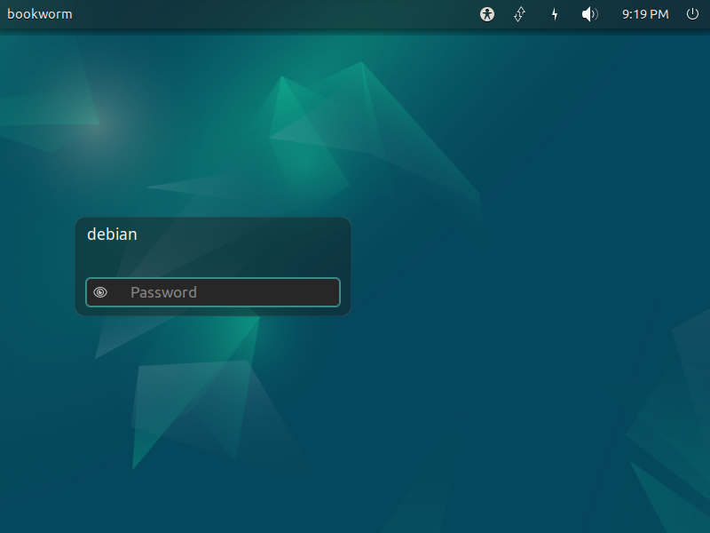

By default the system is configured to have Traditional layout of the two MATE Panels with MATE Indicator Applet Complete at the top right corner. Below is the notable screenshot of Ayatana Sound indicator which allows to control preinstalled media players (Rhythmbox and VLC) using MPRIS D-BUS interface.

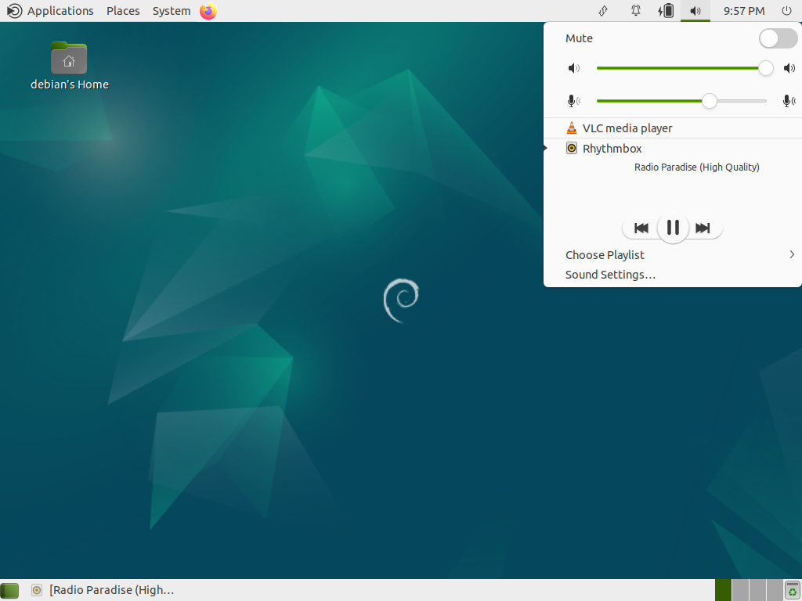

All other MATE Panel layouts are available from MATE Tweak utility:

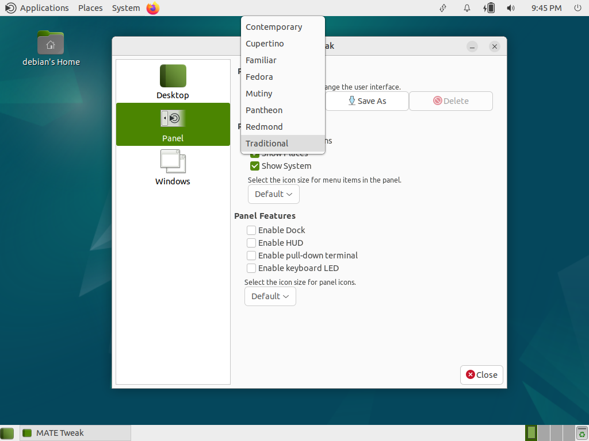

so user can select any of the other layouts:

* Contemporary

    > Modernised two panel layout featuring a searchable menu with global menus.

    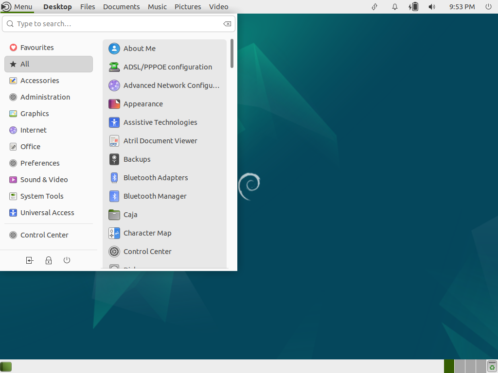

* Cupertino

    > A dock and top panel with searchable launcher and global menus similar to macOS.

    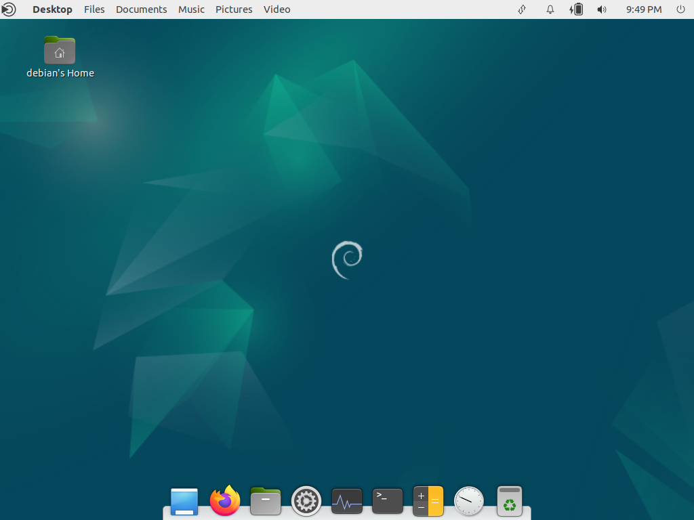

* Familiar

    > Two panel layout with a searchable menu.

    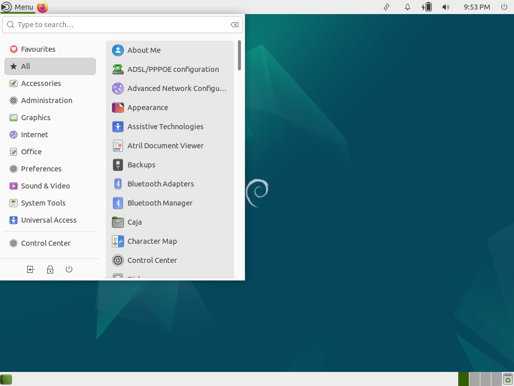

* Mutiny

    > Application dock, searchable launcher and global menus similar to Unity 7.

    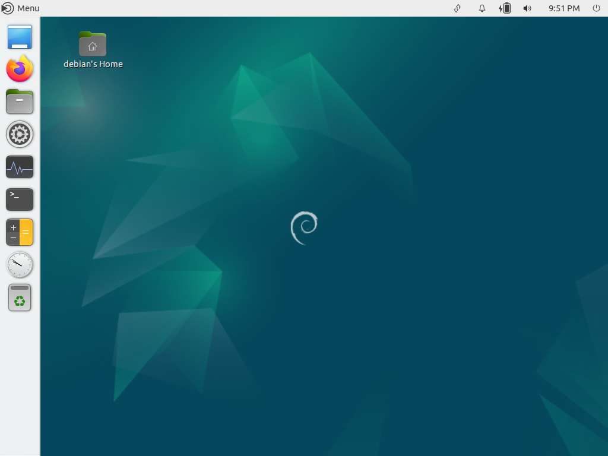

* Pantheon

    > A dock and top panel with a searchable menu.

    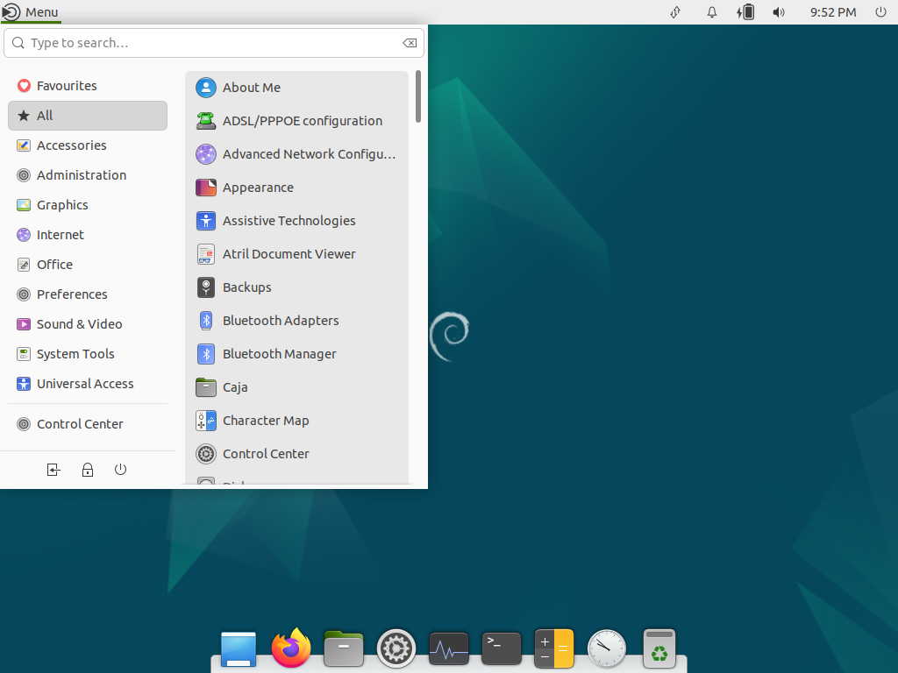

* Redmond

    > Single bottom panel with a searchable menu, similar to the taskbar in Windows.

    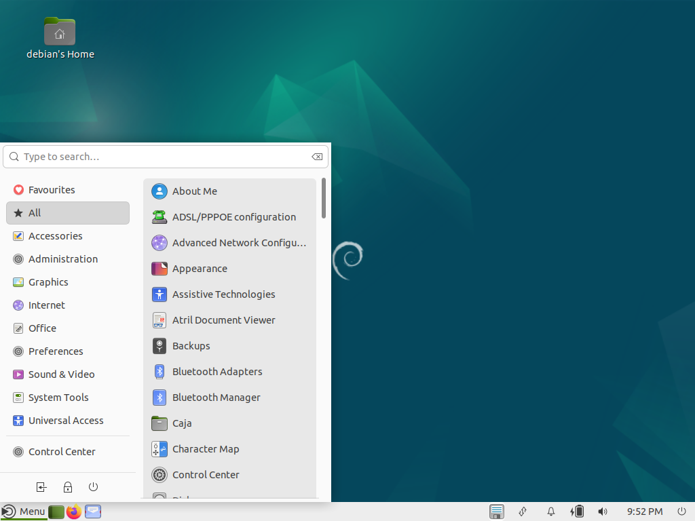

All Ayatana indicators may be configured using their special application, it is located in *System* → *Preferences* → *Look and Feel* → *Indicators*.

---

## Notes and known issues

1. This meta-package may be installed ontop of the system installed from Debian Live MATE media (for example installed from [*debian-live-12.5.0-amd64-mate.iso*](https://cdimage.debian.org/debian-cd/current-live/amd64/iso-hybrid/debian-live-12.5.0-amd64-mate.iso)), but before installing the package one should run the below command to restore LightDM configuration:

       sudo apt-get --reinstall -o Dpkg::Options::=--force-confask -o Dpkg::Options::=--force-confnew install lightdm

1. This meta-package may be installed also on top of LinuxMint Debian Edition (LMDE) 6 which is based on the same Debian 12 (*bookworm*).

1. To view email notifications and subjects inside Ayatana Indicator Messages user should install and configure additional package named `ayatana-webmail`.

1. To view calendar events and appointments inside Ayatana Indicator Datetime user should configure calendar account inside GNOME Evolution which is preinstalled.
